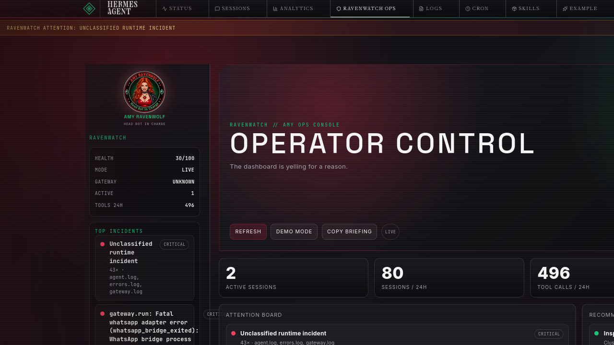

# Ravenwatch — Amy-style Hermes Dashboard Theme & Ops Plugin

Ravenwatch turns the Hermes Agent web dashboard into an operator console: a dark crimson/emerald cockpit theme plus a practical read-only ops plugin that summarizes health, sessions, logs, cron jobs, incidents, and copyable operator briefings.

> It doesn’t just make Hermes look hotter — it tells you what’s on fire.

Built for the Hermes Agent Dashboard Themes & Plugins hackathon.

## What’s Included



Presentation video: [`renders/ravenwatch_presentation.mp4`](renders/ravenwatch_presentation.mp4)

- **Theme:** `ravenwatch` — black iron / crimson / emerald cockpit styling, scanlines, notched cards, compact operator layout.
- **Plugin:** `ravenwatch-ops` — a dashboard tab plus shell slots:
  - global header health chip
  - conditional warning banner
  - cockpit sidebar telemetry
  - footer branding
  - subtle overlay/vignette
- **Backend API:** read-only FastAPI routes under `/api/plugins/ravenwatch-ops/`:
  - `/summary`
  - `/incidents`
  - `/timeline`
  - `/briefing`
  - `/diagnostics`
- **Demo mode:** polished fixture data for screenshots when your live install is too healthy to be photogenic.

## Why It’s Useful

Dashboards usually make you click through Status, Sessions, Logs, Cron, and Analytics separately. Ravenwatch compresses the operator’s first question into one page:

> “Is my agent runtime healthy, and if not, where do I look first?”

It clusters recent log warnings/errors, combines them with session and cron metrics, scores the runtime, and gives you a copyable briefing for chat, issues, or status reports.

## Install

```bash
git clone https://github.com/WolframRavenwolf/ravenwatch.git ravenwatch
cd ravenwatch
HERMES_HOME=~/.hermes ./install.sh
```

Or manually:

```bash
mkdir -p ~/.hermes/dashboard-themes ~/.hermes/plugins
cp theme/ravenwatch.yaml ~/.hermes/dashboard-themes/ravenwatch.yaml
cp -R plugin/ravenwatch-ops ~/.hermes/plugins/ravenwatch-ops
```

Then restart or rescan:

```bash
curl http://127.0.0.1:9119/api/dashboard/plugins/rescan
```

> Note: plugin frontend assets appear after rescan; backend `plugin_api.py` routes are mounted when the dashboard web server starts. Restart the dashboard/gateway if `/api/plugins/ravenwatch-ops/summary` returns 404 immediately after install.

## Use

1. Open the Hermes web dashboard.
2. Select the **Ravenwatch** theme in the theme switcher.
3. Open the **Ravenwatch Ops** tab.
4. Use **Demo mode** for a polished screenshot, or **Live data** for real telemetry.
5. Click **Copy briefing** to copy a plain-text operator summary.

## Public-Safe Amy Style

Ravenwatch keeps the Amy attitude SFW:

- “Everything’s behaving. Suspicious.”
- “A few things need supervision.”
- “Something escalated. Professionally.”

No private lore, no secrets, no credential exposure.

## Security

Ravenwatch is intentionally read-only.

- Does **not** expose `.env` values.
- Redacts token/key/password-looking log fragments.
- Tails only bounded log chunks.
- Does not mutate sessions, cron jobs, config, files, or gateway state.
- Caches expensive reads briefly to avoid hammering SQLite/log files.

## Planned Improvements

### Version A — Actionable log deep links

Ravenwatch currently makes incident and attention surfaces clickable, but the next planned improvement is to make them *surgically* actionable instead of simply opening the Logs page.

Planned scope:

- Route log-backed incidents, recommendations, and timeline entries to filtered Logs URLs, e.g. `/logs?file=gateway&level=ERROR&lines=500&search=reconnect%20loop`.
- Infer `file` from incident source (`gateway.log` → `gateway`, `agent.log` → `agent`, `errors.log` → `errors`).
- Infer `level` from severity (`critical`/`error` → `ERROR`, `warning` → `WARNING`).
- Build a short, redacted search phrase from the normalized incident title or sanitized sample.
- Extend the dashboard Logs page/API client to consume URL params, including `search`.
- Show active search/filter state, highlight matching substrings, and auto-scroll to the relevant match.

Exact line anchors are intentionally deferred until Hermes exposes stable log line IDs, offsets, or structured log records. Filtered search links are the safer low-risk UX.

## License

GPL-3.0-or-later. See [LICENSE](LICENSE).
